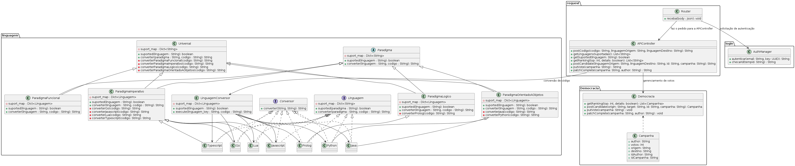

Claro! Vamos adicionar as linguagens aos paradigmas apropriados e incluir uma breve descrição do projeto no documento. Aqui está a versão atualizada:

---

# PoliProgrammer
Um projeto de conversor de linguagens para praticar arquitetura de software.

## Diagrama de Classes em PlantText

As linguagens universais escolhidas atualmente são as seguintes, permitindo conversões entre qualquer linguagem, inclusive entre paradigmas diferentes (se a conversão específica permitir).

## Implementação das Linguagens por Paradigma

### Paradigma Orientado a Objetos
- **Python**
- **C++**

### Paradigma Imperativo
- **JavaScript**

### Paradigma Funcional
- **Haskell**
- **Go**

### Paradigma Lógico
- **Prolog**

### Paradigma Universal (a ponte entre paradigmas)
- **JavaScript**
- **Python**

lembrando que tanto as linguagens quanto os paradigmas são apenas instancias então pode adicionar mais linguagens como universais ou mais linguagens na tradução de forma simples